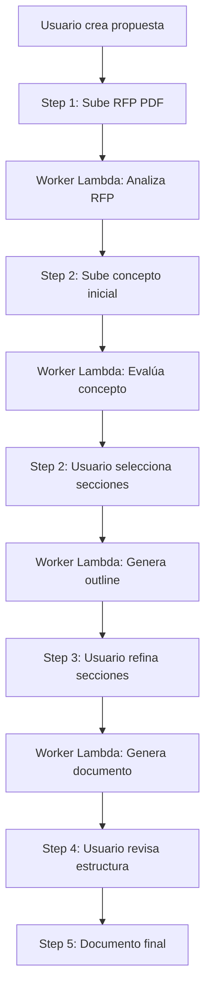

# Proposal Writer - Arquitectura del Sistema

**Última actualización:** 2025-11-29  
**Versión:** 2.0

---

## 📋 Tabla de Contenidos

1. [Descripción General](#descripción-general)
2. [Estructura de Directorios](#estructura-de-directorios)
3. [Flujo de Trabajo](#flujo-de-trabajo)
4. [Componentes Principales](#componentes-principales)
5. [Modelos de Datos](#modelos-de-datos)
6. [Integración con AWS](#integración-con-aws)
7. [Gestión de Errores](#gestión-de-errores)
8. [Configuración y Variables](#configuración-y-variables)

---

## 🎯 Descripción General

El **Proposal Writer** es un sistema asistido por IA que guía a los usuarios en la creación de propuestas de proyectos de alta calidad, alineadas con los requisitos de donantes internacionales.

### Objetivo

Transformar ideas iniciales de proyectos en propuestas profesionales y competitivas mediante:

1. **Análisis de RFP** (Request for Proposal)
2. **Evaluación de concepto** contra requisitos del donante
3. **Generación de estructura** de propuesta optimizada
4. **Creación de documentos** detallados alineados con el donante

### Tecnologías Clave

- **Backend:** FastAPI (Python)
- **IA:** Amazon Bedrock (Claude 3.7 Sonnet)
- **Base de datos:** DynamoDB
- **Almacenamiento:** S3
- **Procesamiento asíncrono:** AWS Lambda
- **Frontend:** React + TypeScript

---

## 📁 Estructura de Directorios

```
proposal_writer/
├── __init__.py                      # Inicialización del módulo
├── routes.py                        # Endpoints API REST
│
├── rfp_analysis/                    # Módulo 1: Análisis de RFP
│   ├── __init__.py
│   ├── config.py                    # Configuración del analizador
│   └── service.py                   # Lógica de análisis de RFP
│
├── concept_evaluation/              # Módulo 2: Evaluación de concepto
│   ├── __init__.py
│   ├── config.py                    # Configuración del evaluador
│   └── service.py                   # Lógica de evaluación
│
├── document_generation/             # Módulo 3: Generación de documentos
│   ├── __init__.py
│   ├── config.py                    # Configuración del generador
│   └── service.py                   # Lógica de generación
│
└── workflow/                        # Orquestación asíncrona
    ├── __init__.py
    └── worker.py                    # Lambda worker para tareas pesadas
```

---

## 🔄 Flujo de Trabajo

### Visión General del Proceso



### Paso a Paso Detallado

#### **Step 1: Carga de RFP**

1. Usuario sube documento PDF del RFP
2. Archivo se guarda en S3: `proposals/{proposal_id}/rfp_document.pdf`
3. API invoca Worker Lambda de manera asíncrona
4. Worker ejecuta `SimpleRFPAnalyzer.analyze_rfp()`
5. Resultado se guarda en DynamoDB

**Datos extraídos:**
- Información del donante
- Criterios de evaluación
- Requisitos de elegibilidad
- Áreas temáticas prioritarias
- Restricciones geográficas
- Presupuesto y plazos

---

#### **Step 2: Evaluación de Concepto**

1. Usuario sube concepto inicial (TXT, PDF, DOCX)
2. Archivo se guarda en S3: `proposals/{proposal_id}/initial_concept.*`
3. Worker Lambda ejecuta `SimpleConceptAnalyzer.analyze_concept()`
4. El análisis evalúa:
   - Alineación con prioridades del donante
   - Fortalezas del concepto
   - Secciones faltantes o débiles
5. Usuario selecciona qué secciones quiere desarrollar
6. Worker genera outline de propuesta con `routes.py: /generate-outline`

**Datos generados:**
- `fit_assessment`: Nivel de alineación (bajo/moderado/alto)
- `strong_aspects`: Fortalezas detectadas
- `sections_needing_elaboration`: 7 secciones críticas con sugerencias
- `strategic_verdict`: Recomendación general

---

#### **Step 3: Generación de Documento Detallado**

1. Usuario confirma secciones seleccionadas (con comentarios opcionales)
2. Worker Lambda ejecuta `ConceptDocumentGenerator.generate_document()`
3. El generador:
   - Carga el proposal outline (Step 2)
   - Filtra solo las secciones seleccionadas
   - Enriquece cada sección con guías del outline
   - Genera contenido narrativo con Claude
4. Documento se guarda en DynamoDB

**Datos generados:**
- `generated_concept_document`: Markdown completo
- `sections`: Diccionario con cada sección individual

---

#### **Step 4: Estructura de Propuesta**

1. Usuario revisa outline generado
2. Puede añadir/editar/eliminar secciones
3. Sistema genera plantilla estructurada

---

#### **Step 5: Documento Final**

1. Usuario descarga documento completo
2. Puede exportar a DOCX, PDF
3. Propuesta lista para revisión y envío

---

## 🧩 Componentes Principales

### 1. **routes.py** - API REST Endpoints

**Responsabilidad:** Definir todos los endpoints HTTP para el frontend.

#### Endpoints Principales

| Método | Ruta | Descripción |
|--------|------|-------------|
| `POST` | `/api/proposals` | Crear nueva propuesta |
| `GET` | `/api/proposals` | Listar propuestas del usuario |
| `GET` | `/api/proposals/{id}` | Obtener detalles de propuesta |
| `PUT` | `/api/proposals/{id}` | Actualizar metadatos |
| `DELETE` | `/api/proposals/{id}` | Eliminar propuesta |
| `POST` | `/api/proposals/{id}/analyze-rfp` | Iniciar análisis de RFP |
| `POST` | `/api/proposals/{id}/analyze-concept` | Iniciar evaluación de concepto |
| `POST` | `/api/proposals/{id}/generate-outline` | Generar outline de propuesta |
| `POST` | `/api/proposals/{id}/generate-document` | Generar documento detallado |
| `GET` | `/api/proposals/{id}/status` | Obtener estado de análisis |

#### Funciones Clave

```python
@router.post("/{proposal_id}/analyze-rfp")
async def analyze_rfp_document(proposal_id: str):
    """
    Invoca Worker Lambda de manera asíncrona para analizar RFP.
    
    Flujo:
    1. Valida que exista RFP cargado
    2. Invoca Lambda: proposal-writer-analysis-worker
    3. Pasa payload: {"task": "analyze_rfp", "proposal_id": "..."}
    4. Retorna inmediatamente (status: processing)
    """
```

```python
@router.post("/{proposal_id}/analyze-concept")
async def analyze_concept_document(proposal_id: str):
    """
    Evalúa concepto contra RFP.
    
    Requiere:
    - RFP analysis completado
    - Concepto inicial cargado
    
    Invoca Lambda con task: "analyze_concept"
    """
```

```python
@router.post("/{proposal_id}/generate-outline")
async def generate_proposal_outline(
    proposal_id: str,
    body: ConceptEvaluationUpdate
):
    """
    Genera estructura de propuesta basada en secciones seleccionadas.
    
    Input:
    - selected_sections: Lista de secciones a desarrollar
    - user_comments: Comentarios adicionales del usuario
    
    Invoca Lambda con task: "generate_outline"
    """
```

```python
@router.post("/{proposal_id}/generate-document")
async def generate_concept_document(
    proposal_id: str,
    body: ConceptEvaluationUpdate
):
    """
    Genera documento narrativo completo.
    
    Combina:
    - RFP analysis
    - Concept evaluation (filtrado)
    - Proposal outline (enriquecido)
    
    Invoca Lambda con task: "generate_document"
    """
```

---

### 2. **rfp_analysis/service.py** - Análisis de RFP

**Clase:** `SimpleRFPAnalyzer`

**Responsabilidad:** Extraer información estructurada de documentos RFP.

#### Métodos Principales

```python
def analyze_rfp(self, proposal_id: str) -> Dict[str, Any]:
    """
    Analiza documento RFP y extrae información clave.
    
    Workflow:
    1. Cargar propuesta desde DynamoDB
    2. Descargar PDF desde S3
    3. Extraer texto con PyPDF2
    4. Cargar prompt desde DynamoDB
    5. Invocar Claude vía Bedrock
    6. Parsear JSON de respuesta
    7. Guardar análisis en DynamoDB
    
    Returns:
        {
            "rfp_analysis": {
                "summary": {...},
                "extracted_data": {...},
                "evaluation_criteria": [...],
                "eligibility_requirements": [...],
                ...
            },
            "status": "completed"
        }
    """
```

#### Prompt System

El prompt se carga dinámicamente desde DynamoDB:

**Filtro:**
```python
FilterExpression=
    Attr("is_active").eq(True) &
    Attr("section").eq("proposal_writer") &
    Attr("sub_section").eq("step-1") &
    Attr("categories").contains("RFP Analysis")
```

**Campos cargados:**
- `system_prompt`: Rol del agente IA
- `user_prompt_template`: Instrucciones con placeholders
- `output_format`: Formato esperado de respuesta

#### Configuración Bedrock

```python
response = self.bedrock.invoke_claude(
    system_prompt=prompt_parts['system_prompt'],
    user_prompt=final_prompt,
    max_tokens=5000,  # Respuesta larga
    temperature=0.5   # Consistencia alta
)
```

---

### 3. **concept_evaluation/service.py** - Evaluación de Concepto

**Clase:** `SimpleConceptAnalyzer`

**Responsabilidad:** Evaluar alineación del concepto con requisitos RFP.

#### Métodos Principales

```python
def analyze_concept(
    self, 
    proposal_id: str, 
    rfp_analysis: Dict
) -> Dict[str, Any]:
    """
    Evalúa concepto inicial contra análisis RFP.
    
    Workflow:
    1. Cargar concepto desde S3 (TXT/PDF/DOCX)
    2. Extraer texto según formato
    3. Cargar prompt de evaluación
    4. Inyectar contexto (RFP + concepto)
    5. Invocar Claude
    6. Parsear evaluación
    7. Guardar en DynamoDB
    
    Returns:
        {
            "concept_analysis": {
                "fit_assessment": {
                    "overall_alignment_level": "moderate/high/low",
                    "thematic_fit": {...},
                    "geographic_alignment": {...}
                },
                "strong_aspects": [
                    "Aspecto 1 bien desarrollado",
                    ...
                ],
                "sections_needing_elaboration": [
                    {
                        "section": "Theory of Change",
                        "issue": "Descripción del problema",
                        "priority": "Critical",
                        "suggestions": "Desarrollar..."
                    },
                    ...
                ],
                "strategic_verdict": "Recomendación general"
            },
            "status": "completed"
        }
    """
```

#### Soporte Multi-Formato

```python
def _extract_concept_text(self, file_key: str) -> str:
    """
    Extrae texto del concepto según extensión.
    
    Soporta:
    - .txt: Lectura directa
    - .pdf: PyPDF2
    - .docx: python-docx
    
    Maneja:
    - Archivos grandes (límite de caracteres)
    - Encoding UTF-8
    - Errores de formato
    """
```

#### Prompt System

**Filtro DynamoDB:**
```python
FilterExpression=
    Attr("is_active").eq(True) &
    Attr("section").eq("proposal_writer") &
    Attr("sub_section").eq("step-2") &
    Attr("categories").contains("Concept Review")
```

**Configuración Bedrock:**
```python
response = self.bedrock.invoke_claude(
    system_prompt=prompt_parts['system_prompt'],
    user_prompt=final_prompt,
    max_tokens=12000,  # Evaluación extensa
    temperature=0.5
)
```

---

### 4. **document_generation/service.py** - Generación de Documentos

**Clase:** `ConceptDocumentGenerator`

**Responsabilidad:** Generar documentos narrativos detallados.

#### Métodos Principales

```python
def generate_document(
    self,
    proposal_code: str,
    rfp_analysis: Dict[str, Any],
    concept_evaluation: Dict[str, Any],
    proposal_outline: Optional[Dict[str, Any]] = None
) -> Dict[str, Any]:
    """
    Genera documento narrativo profesional.
    
    Workflow:
    1. Cargar prompt de generación
    2. Cargar proposal outline (si no provisto)
    3. Filtrar secciones seleccionadas
    4. Enriquecer con datos del outline
    5. Preparar contexto completo
    6. Invocar Claude
    7. Parsear markdown generado
    8. Retornar documento estructurado
    
    Returns:
        {
            "generated_concept_document": "# Título\n\n## Sección...",
            "sections": {
                "Theory of Change": "Contenido...",
                "Gender Strategy": "Contenido...",
                ...
            },
            "status": "completed",
            "started_at": "2025-11-29T...",
            "completed_at": "2025-11-29T..."
        }
    """
```

#### Filtrado y Enriquecimiento

```python
def _filter_selected_sections(
    self, 
    concept_evaluation: Dict[str, Any]
) -> Dict[str, Any]:
    """
    Filtra solo secciones marcadas como selected=True.
    
    Importante:
    - Reduce tamaño del prompt significativamente
    - Evita timeouts de Bedrock
    - Mejora relevancia de respuesta
    """

def _enrich_with_outline(
    self,
    filtered_evaluation: Dict[str, Any],
    proposal_outline: Dict[str, Any]
) -> Dict[str, Any]:
    """
    Enriquece secciones con datos del outline.
    
    Agrega a cada sección:
    - recommended_word_count: "800-1000 words"
    - purpose: "Explicar el propósito..."
    - content_guidance: "Debe incluir..."
    - guiding_questions: ["¿Pregunta 1?", ...]
    
    Optimiza:
    - content_guidance largo (>1000 chars) se resume
    """
```

#### Configuración Bedrock

```python
response = self.bedrock.invoke_claude(
    system_prompt=prompt_parts['system_prompt'],
    user_prompt=final_prompt,
    max_tokens=12000,  # Documentos largos
    temperature=0.7    # Creatividad moderada
)
```

**Timeout Management:**
```python
# Implementado en worker.py con reintentos exponenciales
max_retries = 3
base_delay = 30  # segundos
```

---

### 5. **workflow/worker.py** - Worker Lambda

**Responsabilidad:** Orquestar tareas asíncronas pesadas.

#### Handler Principal

```python
def lambda_handler(event, context):
    """
    Lambda handler para procesamiento asíncrono.
    
    Tareas soportadas:
    - analyze_rfp: Analizar documento RFP
    - analyze_concept: Evaluar concepto inicial
    - generate_outline: Crear estructura de propuesta
    - generate_document: Generar documento narrativo
    
    Timeout: 15 minutos
    Memory: 1024 MB
    """
```

#### Funciones de Orquestación

```python
def _handle_rfp_analysis(proposal_id: str) -> Dict[str, Any]:
    """
    Ejecuta análisis de RFP con retry logic.
    
    Workflow:
    1. Set status: processing
    2. Ejecutar SimpleRFPAnalyzer.analyze_rfp()
    3. Guardar resultado en DynamoDB
    4. Set status: completed
    5. En caso de error: Set status: failed
    
    Reintentos: 3 intentos con backoff exponencial
    """

def _handle_concept_analysis(proposal_id: str) -> Dict[str, Any]:
    """
    Ejecuta evaluación de concepto.
    
    Requiere:
    - RFP analysis completado
    - Concepto inicial cargado
    
    Similar workflow a RFP analysis
    """

def _handle_outline_generation(
    proposal_id: str,
    selected_sections: List[Dict],
    user_comments: Dict
) -> Dict[str, Any]:
    """
    Genera outline de propuesta.
    
    Input especial:
    - selected_sections: Secciones marcadas para desarrollar
    - user_comments: Comentarios del usuario por sección
    
    Output guardado en: PROPOSAL#{id}#OUTLINE
    """

def _handle_document_generation(
    proposal_id: str,
    selected_sections: List[Dict],
    user_comments: Dict
) -> Dict[str, Any]:
    """
    Genera documento narrativo completo.
    
    Combina:
    - RFP analysis
    - Concept evaluation (filtrado)
    - Proposal outline
    - User comments
    
    Retry logic con timeouts extendidos
    """
```

#### Gestión de Estado DynamoDB

```python
def _set_processing_status(proposal_id: str, analysis_type: str):
    """Marca análisis como 'processing' con timestamp"""

def _set_completed_status(
    proposal_id: str, 
    analysis_type: str, 
    result: Dict
):
    """Marca análisis como 'completed' y guarda resultado"""

def _set_failed_status(
    proposal_id: str, 
    analysis_type: str, 
    error_message: str
):
    """Marca análisis como 'failed' con mensaje de error"""
```

#### Retry Logic con Backoff Exponencial

```python
def _retry_with_exponential_backoff(
    func,
    max_retries=3,
    base_delay=30,
    max_delay=300
):
    """
    Reintenta función con delays crecientes.
    
    Delays:
    - Intento 1: 30 segundos
    - Intento 2: 60 segundos
    - Intento 3: 120 segundos
    
    Usado para:
    - Llamadas a Bedrock (timeouts)
    - Operaciones DynamoDB (throttling)
    """
```

---

## 📊 Modelos de Datos

### Estructura de Propuesta en DynamoDB

#### Item Principal: `PROPOSAL#{id}#METADATA`

```json
{
  "PK": "PROPOSAL#PROP-20251129-A1B2",
  "SK": "METADATA",
  "GSI1PK": "USER#user123",
  "GSI1SK": "PROPOSAL#2025-11-29T10:30:00Z",
  
  "proposal_code": "PROP-20251129-A1B2",
  "title": "AI for Climate Resilience",
  "description": "Project to enhance smallholder...",
  "status": "draft",
  
  "uploaded_files": {
    "rfp_document": "proposals/.../rfp_document.pdf",
    "initial_concept": "proposals/.../initial_concept.txt"
  },
  
  "analysis_status_rfp": "completed",
  "rfp_analysis_started_at": "2025-11-29T10:31:00Z",
  "rfp_analysis_completed_at": "2025-11-29T10:32:15Z",
  
  "analysis_status_concept": "processing",
  "concept_analysis_started_at": "2025-11-29T10:35:00Z",
  
  "concept_document_status": "pending",
  
  "created_at": "2025-11-29T10:30:00Z",
  "updated_at": "2025-11-29T10:35:30Z",
  "created_by": "user123"
}
```

#### Item RFP Analysis: `PROPOSAL#{id}#RFP_ANALYSIS`

```json
{
  "PK": "PROPOSAL#PROP-20251129-A1B2",
  "SK": "RFP_ANALYSIS",
  
  "rfp_analysis": {
    "summary": {
      "donor_name": "Global Climate Fund",
      "program_title": "Climate Resilience Initiative",
      "total_budget": "$5,000,000",
      "project_duration": "36 months"
    },
    "extracted_data": {
      "thematic_priorities": [
        "Climate adaptation",
        "Smallholder agriculture",
        "AI/technology for development"
      ],
      "geographic_focus": ["East Africa", "IGAD region"],
      "target_beneficiaries": "Smallholder farmers"
    },
    "evaluation_criteria": [
      {
        "criterion": "Relevance",
        "weight": 30,
        "description": "Alignment with donor priorities"
      },
      {
        "criterion": "Innovation",
        "weight": 25,
        "description": "Novel approaches and technologies"
      }
    ],
    "eligibility_requirements": [
      "Registered NGO with 5+ years experience",
      "Previous climate projects in target region"
    ]
  },
  "status": "completed",
  "created_at": "2025-11-29T10:32:15Z"
}
```

#### Item Concept Evaluation: `PROPOSAL#{id}#CONCEPT_ANALYSIS`

```json
{
  "PK": "PROPOSAL#PROP-20251129-A1B2",
  "SK": "CONCEPT_ANALYSIS",
  
  "concept_analysis": {
    "fit_assessment": {
      "overall_alignment_level": "moderate",
      "alignment_score": 7,
      "thematic_fit": {
        "level": "high",
        "explanation": "Strong focus on climate and agriculture..."
      },
      "geographic_alignment": {
        "level": "high",
        "explanation": "Targets IGAD region as required..."
      }
    },
    "strong_aspects": [
      "Clear focus on climate adaptation",
      "Innovative use of AI technology",
      "Strong community engagement approach"
    ],
    "sections_needing_elaboration": [
      {
        "section": "Theory of Change",
        "issue": "Lacks clear causal pathway",
        "priority": "Critical",
        "suggestions": "Develop detailed logic model...",
        "selected": true,
        "user_comment": "Will add specific indicators"
      },
      {
        "section": "Gender and Social Inclusion Strategy",
        "issue": "Limited gender analysis",
        "priority": "Critical",
        "suggestions": "Include gender-responsive approaches...",
        "selected": true,
        "user_comment": ""
      },
      {
        "section": "Sustainability and Exit Strategy",
        "issue": "Exit strategy not defined",
        "priority": "Recommended",
        "suggestions": "Outline phase-out plan...",
        "selected": false,
        "user_comment": ""
      }
    ],
    "strategic_verdict": "Concept shows moderate alignment..."
  },
  "status": "completed",
  "created_at": "2025-11-29T10:37:22Z"
}
```

#### Item Proposal Outline: `PROPOSAL#{id}#OUTLINE`

```json
{
  "PK": "PROPOSAL#PROP-20251129-A1B2",
  "SK": "OUTLINE",
  
  "proposal_mandatory": [
    {
      "section_title": "Executive Summary",
      "recommended_word_count": "500-700 words",
      "purpose": "Provide concise overview of the proposal",
      "content_guidance": "Should include: problem statement, proposed solution, expected impact, budget summary",
      "guiding_questions": [
        "What is the core problem being addressed?",
        "What is your proposed solution?",
        "What will be the key outcomes?"
      ]
    }
  ],
  "proposal_outline": [
    {
      "section_title": "Theory of Change",
      "recommended_word_count": "800-1000 words",
      "purpose": "Explain the causal pathway from activities to impact",
      "content_guidance": "Include: inputs, activities, outputs, outcomes, impact, assumptions",
      "guiding_questions": [
        "What are the key inputs and activities?",
        "What outputs will be produced?",
        "How do outputs lead to outcomes?",
        "What assumptions underlie this pathway?"
      ]
    },
    {
      "section_title": "Gender and Social Inclusion Strategy",
      "recommended_word_count": "600-800 words",
      "purpose": "Demonstrate commitment to equity and inclusion",
      "content_guidance": "Include: gender analysis, inclusion mechanisms, GESI indicators",
      "guiding_questions": [
        "How will women and marginalized groups benefit?",
        "What barriers to participation exist?",
        "How will you measure GESI outcomes?"
      ]
    }
  ],
  "hcd_notes": [
    {
      "note": "Structure follows donor's evaluation criteria weights"
    }
  ],
  "created_at": "2025-11-29T10:40:15Z"
}
```

#### Item Concept Document: `PROPOSAL#{id}#CONCEPT_DOCUMENT_V2`

```json
{
  "PK": "PROPOSAL#PROP-20251129-A1B2",
  "SK": "CONCEPT_DOCUMENT_V2",
  
  "generated_concept_document": "# AI for Climate Resilience\n\n## Theory of Change\n\nOur Theory of Change establishes...",
  
  "sections": {
    "Theory of Change": "Our Theory of Change establishes a clear pathway...",
    "Gender and Social Inclusion Strategy": "The project commits to ensuring..."
  },
  
  "status": "completed",
  "started_at": "2025-11-29T10:45:00Z",
  "completed_at": "2025-11-29T10:48:33Z"
}
```

---

## 🔌 Integración con AWS

### Amazon Bedrock

**Servicio:** Claude 3.7 Sonnet (`us.anthropic.claude-3-7-sonnet-20250219-v1:0`)

**Ubicación:** `app/shared/ai/bedrock_service.py`

```python
class BedrockService:
    def invoke_claude(
        self,
        system_prompt: str,
        user_prompt: str,
        max_tokens: int = 4000,
        temperature: float = 0.7
    ) -> str:
        """
        Invoca Claude vía Bedrock.
        
        Timeout: 600 segundos (10 minutos)
        Retry: Automático con boto3
        
        Returns:
            Texto de respuesta parseado
        """
```

**Configuración por Servicio:**

| Servicio | max_tokens | temperature | Tiempo estimado |
|----------|------------|-------------|----------------|
| RFP Analysis | 5,000 | 0.5 | 30-60 seg |
| Concept Evaluation | 12,000 | 0.5 | 60-90 seg |
| Outline Generation | 8,000 | 0.7 | 45-75 seg |
| Document Generation | 12,000 | 0.7 | 2-5 min |

### DynamoDB

**Tabla:** `igad-testing-main-table`

**Patrón de Acceso:**

```
Single-Table Design con GSI

PK = PROPOSAL#{proposal_id}
SK = METADATA | RFP_ANALYSIS | CONCEPT_ANALYSIS | OUTLINE | CONCEPT_DOCUMENT_V2

GSI1:
PK = USER#{user_id}
SK = PROPOSAL#{created_at}
```

**Operaciones:**

```python
# Crear propuesta
db_client.put_item_sync(
    pk=f"PROPOSAL#{proposal_code}",
    sk="METADATA",
    gsi1_pk=f"USER#{user_id}",
    gsi1_sk=f"PROPOSAL#{created_at}",
    item={...}
)

# Obtener propuesta
proposal = db_client.get_item_sync(
    pk=f"PROPOSAL#{proposal_id}",
    sk="METADATA"
)

# Listar propuestas del usuario
proposals = db_client.query_items(
    pk=f"USER#{user_id}",
    index_name="GSI1",
    scan_index_forward=False  # Más recientes primero
)

# Actualizar análisis
db_client.update_item_sync(
    pk=f"PROPOSAL#{proposal_id}",
    sk="METADATA",
    update_expression="SET analysis_status_rfp = :status",
    expression_attribute_values={":status": "completed"}
)

# Guardar análisis
db_client.put_item_sync(
    pk=f"PROPOSAL#{proposal_id}",
    sk="RFP_ANALYSIS",
    item={"rfp_analysis": {...}}
)
```

### S3

**Bucket:** `igad-testing-proposals`

**Estructura:**

```
proposals/
  └── {proposal_id}/
      ├── rfp_document.pdf              # RFP original
      ├── initial_concept.txt            # Concepto inicial
      ├── initial_concept.pdf            # Alternativa PDF
      ├── initial_concept.docx           # Alternativa DOCX
      └── generated_documents/           # Documentos generados
          ├── concept_document_v1.docx
          └── proposal_outline.pdf
```

**Operaciones:**

```python
# Upload file
s3.put_object(
    Bucket=bucket,
    Key=f"proposals/{proposal_id}/rfp_document.pdf",
    Body=file_content,
    ContentType="application/pdf"
)

# Download file
response = s3.get_object(
    Bucket=bucket,
    Key=file_key
)
content = response['Body'].read()

# Generate presigned URL (descarga directa)
url = s3.generate_presigned_url(
    'get_object',
    Params={'Bucket': bucket, 'Key': file_key},
    ExpiresIn=3600  # 1 hora
)
```

### AWS Lambda

**Worker Lambda:** `proposal-writer-analysis-worker`

**Configuración:**
- Runtime: Python 3.11
- Memory: 1024 MB
- Timeout: 900 segundos (15 minutos)
- Concurrency: 10

**Variables de Entorno:**
```
TABLE_NAME=igad-testing-main-table
PROPOSALS_BUCKET=igad-testing-proposals
AWS_REGION=us-east-1
```

**Invocación desde API:**

```python
lambda_client = boto3.client('lambda')

response = lambda_client.invoke(
    FunctionName='proposal-writer-analysis-worker',
    InvocationType='Event',  # Asíncrono
    Payload=json.dumps({
        "task": "analyze_rfp",
        "proposal_id": "PROP-20251129-A1B2"
    })
)
```

---

## ⚠️ Gestión de Errores

### Estrategia de Reintentos

**Worker Lambda:**

```python
def _retry_with_exponential_backoff(
    func,
    max_retries=3,
    base_delay=30,
    max_delay=300
):
    """
    Patrón de reintentos para operaciones pesadas.
    
    Delays:
    - Retry 1: 30s
    - Retry 2: 60s
    - Retry 3: 120s
    
    Casos de uso:
    - Bedrock timeouts
    - DynamoDB throttling
    - S3 transient errors
    """
    for attempt in range(max_retries):
        try:
            return func()
        except Exception as e:
            if attempt == max_retries - 1:
                raise
            delay = min(base_delay * (2 ** attempt), max_delay)
            time.sleep(delay)
```

### Estados de Error

**En DynamoDB:**

```python
# Error en análisis RFP
{
    "analysis_status_rfp": "failed",
    "rfp_analysis_error": "Bedrock timeout after 600s",
    "rfp_analysis_failed_at": "2025-11-29T10:35:00Z"
}

# Error en generación de documento
{
    "concept_document_status": "failed",
    "concept_document_error": "Max retries exceeded (3/3)",
    "concept_document_failed_at": "2025-11-29T10:50:00Z"
}
```

### Logs Estructurados

**Formato:**

```python
logger.info("=" * 80)
logger.info("📋 Step 1/3: Loading RFP document")
logger.info(f"   Proposal ID: {proposal_id}")
logger.info(f"   File key: {file_key}")
logger.info("=" * 80)

logger.error(f"❌ Error in RFP analysis: {str(e)}")
logger.error(traceback.format_exc())
```

**CloudWatch:**

Todos los logs se envían a CloudWatch Logs con grupos:

- `/aws/lambda/proposal-writer-analysis-worker`
- `/aws/lambda/igad-testing-api`

---

## ⚙️ Configuración y Variables

### Variables de Entorno

**Backend API (`igad-app/backend/.env`):**

```bash
TABLE_NAME=igad-testing-main-table
PROPOSALS_BUCKET=igad-testing-proposals
AWS_REGION=us-east-1
BEDROCK_MODEL_ID=us.anthropic.claude-3-7-sonnet-20250219-v1:0
```

**Lambda Worker (`serverless.yml`):**

```yaml
environment:
  TABLE_NAME: ${env:TABLE_NAME}
  PROPOSALS_BUCKET: ${env:PROPOSALS_BUCKET}
  AWS_REGION: ${env:AWS_REGION}
```

### Config Files

**rfp_analysis/config.py:**

```python
RFP_ANALYSIS_SETTINGS = {
    "table_name": os.environ.get("TABLE_NAME"),
    "max_tokens": 5000,
    "temperature": 0.5,
    "timeout": 600  # 10 minutos
}
```

**concept_evaluation/config.py:**

```python
CONCEPT_EVALUATION_SETTINGS = {
    "table_name": os.environ.get("TABLE_NAME"),
    "max_tokens": 12000,
    "temperature": 0.5,
    "timeout": 600
}
```

**document_generation/config.py:**

```python
DOCUMENT_GENERATION_SETTINGS = {
    "table_name": os.environ.get("TABLE_NAME"),
    "max_tokens": 12000,
    "temperature": 0.7,
    "timeout": 900  # 15 minutos
}
```

---

## 📈 Métricas y Monitoreo

### CloudWatch Metrics

**Métricas clave:**

- Lambda invocations
- Lambda duration
- Lambda errors
- DynamoDB read/write capacity
- S3 GET/PUT requests
- Bedrock invocation latency

### Logs de Debugging

**Ejemplo de log completo:**

```
================================
🚀 Starting RFP Analysis
================================
📋 Step 1/3: Loading RFP document
   Proposal ID: PROP-20251129-A1B2
   File key: proposals/PROP-20251129-A1B2/rfp_document.pdf
   File size: 2.3 MB
================================
📄 Step 2/3: Extracting text from PDF
   Pages extracted: 45
   Total characters: 98,432
================================
📡 Step 3/3: Calling Bedrock AI
   Model: claude-3-7-sonnet
   Max tokens: 5000
   Temperature: 0.5
   Prompt size: ~105,000 characters
   Estimated time: 30-60 seconds
================================
✅ RFP Analysis completed
   Duration: 52.3 seconds
   Response size: 8,234 characters
================================
```

---

## 🚀 Mejoras Futuras

### En Desarrollo

1. **Streaming de respuestas** para feedback en tiempo real
2. **Chunking de documentos** grandes para evitar timeouts
3. **Cache de análisis** RFP para propuestas similares
4. **Versioning** de documentos generados
5. **Colaboración multi-usuario** en propuestas

### Optimizaciones Planificadas

1. Reducir tamaño de prompts con técnicas de compresión
2. Implementar prompt caching en Bedrock
3. Paralelizar análisis de secciones independientes
4. Pre-entrenar modelos con prompts frecuentes

---

## 📞 Soporte

**Desarrolladores:**
- Backend: Juan Cadavid
- Frontend: Equipo Alliance

**Documentación adicional:**
- `SESSION_2025-11-28_TIMEOUT_AND_PROMPT_FIX.md`: Soluciones a timeouts
- `STEP_RESTRUCTURE_PLAN.md`: Plan de reestructuración frontend

---

**Fin del documento** 🎯
