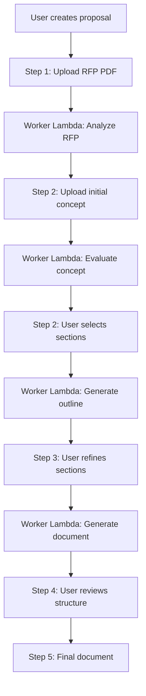

# Proposal Writer - System Architecture

**Last Updated:** 2025-11-29
**Version:** 2.0

---

## 📋 Table of Contents

1. [Overview](#overview)
2. [Directory Structure](#directory-structure)
3. [Workflow](#workflow)
4. [Main Components](#main-components)
5. [Data Models](#data-models)
6. [AWS Integration](#aws-integration)
7. [Error Handling](#error-handling)
8. [Configuration and Variables](#configuration-and-variables)

---

## 🎯 Overview

The **Proposal Writer** is an AI-assisted system that guides users in creating high-quality project proposals aligned with international donor requirements.

### Objective

Transform initial project ideas into professional and competitive proposals through:

1. **RFP Analysis** (Request for Proposal)
2. **Concept Evaluation** against donor requirements
3. **Optimized Structure Generation**
4. **Detailed Document Creation** aligned with the donor

### Key Technologies

- **Backend:** FastAPI (Python)
- **AI:** Amazon Bedrock (Claude 3.7 Sonnet)
- **Database:** DynamoDB
- **Storage:** S3
- **Async Processing:** AWS Lambda
- **Frontend:** React + TypeScript

---

## 📁 Directory Structure

```
proposal_writer/
├── __init__.py                      # Module initialization
├── routes.py                        # REST API Endpoints
│
├── rfp_analysis/                    # Module 1: RFP Analysis
│   ├── __init__.py
│   ├── config.py                    # Analyzer configuration
│   └── service.py                   # RFP analysis logic
│
├── concept_evaluation/              # Module 2: Concept Evaluation
│   ├── __init__.py
│   ├── config.py                    # Evaluator configuration
│   └── service.py                   # Evaluation logic
│
├── concept_document_generation/     # Module 3: Concept Document Generation
│   ├── __init__.py
│   ├── config.py                    # Generator configuration
│   └── service.py                   # Generation logic
│
└── workflow/                        # Async Orchestration
    ├── __init__.py
    └── worker.py                    # Lambda worker for heavy tasks
```

---

## 🔄 Workflow

### Process Overview



### Detailed Step-by-Step

#### **Step 1: RFP Upload**

1. User uploads RFP PDF document.
2. File is saved to S3: `proposals/{proposal_id}/rfp_document.pdf`.
3. API invokes Worker Lambda asynchronously.
4. Worker executes `SimpleRFPAnalyzer.analyze_rfp()`.
5. Result is saved to DynamoDB.

**Extracted Data:**
- Donor information
- Evaluation criteria
- Eligibility requirements
- Priority thematic areas
- Geographic restrictions
- Budget and timelines

---

#### **Step 2: Concept Evaluation**

1. User uploads initial concept (TXT, PDF, DOCX).
2. File is saved to S3: `proposals/{proposal_id}/initial_concept.*`.
3. Worker Lambda executes `SimpleConceptAnalyzer.analyze_concept()`.
4. The analysis evaluates:
   - Alignment with donor priorities
   - Strengths of the concept
   - Missing or weak sections
5. User selects which sections to develop.
6. Worker generates proposal outline with `routes.py: /generate-outline`.

**Generated Data:**
- `fit_assessment`: Alignment level (low/moderate/high)
- `strong_aspects`: Detected strengths
- `sections_needing_elaboration`: 7 critical sections with suggestions
- `strategic_verdict`: General recommendation

---

#### **Step 3: Detailed Document Generation**

1. User confirms selected sections (with optional comments).
2. Worker Lambda executes `ConceptDocumentGenerator.generate_document()`.
3. The generator:
   - Loads the proposal outline (Step 2)
   - Filters only selected sections
   - Enriches each section with outline guides
   - Generates narrative content with Claude
4. Document is saved to DynamoDB.

**Generated Data:**
- `generated_concept_document`: Complete Markdown
- `sections`: Dictionary with each individual section

---

#### **Step 4: Proposal Structure**

1. User reviews generated outline.
2. Can add/edit/delete sections.
3. System generates structured template.

---

#### **Step 5: Final Document**

1. User downloads complete document.
2. Can export to DOCX, PDF.
3. Proposal ready for review and submission.

---

## 🧩 Main Components

### 1. **routes.py** - REST API Endpoints

**Responsibility:** Define all HTTP endpoints for the frontend.

#### Key Endpoints

| Method | Route | Description |
|--------|------|-------------|
| `POST` | `/api/proposals` | Create new proposal |
| `GET` | `/api/proposals` | List user proposals |
| `GET` | `/api/proposals/{id}` | Get proposal details |
| `PUT` | `/api/proposals/{id}` | Update metadata |
| `DELETE` | `/api/proposals/{id}` | Delete proposal |
| `POST` | `/api/proposals/{id}/analyze-rfp` | Start RFP analysis |
| `POST` | `/api/proposals/{id}/analyze-concept` | Start concept evaluation |
| `POST` | `/api/proposals/{id}/generate-outline` | Generate proposal outline |
| `POST` | `/api/proposals/{id}/generate-document` | Generate detailed document |
| `GET` | `/api/proposals/{id}/status` | Get analysis status |

#### Key Functions

```python
@router.post("/{proposal_id}/analyze-rfp")
async def analyze_rfp_document(proposal_id: str):
    """
    Invokes Worker Lambda asynchronously to analyze RFP.
    
    Flow:
    1. Validates that RFP is uploaded
    2. Invokes Lambda: proposal-writer-analysis-worker
    3. Passes payload: {"task": "analyze_rfp", "proposal_id": "..."}
    4. Returns immediately (status: processing)
    """
```

```python
@router.post("/{proposal_id}/analyze-concept")
async def analyze_concept_document(proposal_id: str):
    """
    Evaluates concept against RFP.
    
    Requires:
    - RFP analysis completed
    - Initial concept uploaded
    
    Invokes Lambda with task: "analyze_concept"
    """
```

```python
@router.post("/{proposal_id}/generate-outline")
async def generate_proposal_outline(
    proposal_id: str,
    body: ConceptEvaluationUpdate
):
    """
    Generates proposal structure based on selected sections.
    
    Input:
    - selected_sections: List of sections to develop
    - user_comments: Additional user comments
    
    Invokes Lambda with task: "generate_outline"
    """
```

```python
@router.post("/{proposal_id}/generate-document")
async def generate_concept_document(
    proposal_id: str,
    body: ConceptEvaluationUpdate
):
    """
    Generates complete narrative document.
    
    Combines:
    - RFP analysis
    - Concept evaluation (filtered)
    - Proposal outline (enriched)
    
    Invokes Lambda with task: "generate_document"
    """
```

---

### 2. **rfp_analysis/service.py** - RFP Analysis

**Class:** `SimpleRFPAnalyzer`

**Responsibility:** Extract structured information from RFP documents.

#### Main Methods

```python
def analyze_rfp(self, proposal_id: str) -> Dict[str, Any]:
    """
    Analyzes RFP document and extracts key information.
    
    Workflow:
    1. Load proposal from DynamoDB
    2. Download PDF from S3
    3. Extract text with PyPDF2
    4. Load prompt from DynamoDB
    5. Invoke Claude via Bedrock
    6. Parse response JSON
    7. Save analysis to DynamoDB
    
    Returns:
        {
            "rfp_analysis": {
                "summary": {...},
                "extracted_data": {...},
                "evaluation_criteria": [...],
                "eligibility_requirements": [...],
                ...
            },
            "status": "completed"
        }
    """
```

#### Prompt System

The prompt is loaded dynamically from DynamoDB:

**Filter:**
```python
FilterExpression=
    Attr("is_active").eq(True) &
    Attr("section").eq("proposal_writer") &
    Attr("sub_section").eq("step-1") &
    Attr("categories").contains("RFP Analysis")
```

**Loaded fields:**
- `system_prompt`: AI Agent Role
- `user_prompt_template`: Instructions with placeholders
- `output_format`: Expected response format

#### Bedrock Configuration

```python
response = self.bedrock.invoke_claude(
    system_prompt=prompt_parts['system_prompt'],
    user_prompt=final_prompt,
    max_tokens=5000,  # Long response
    temperature=0.5   # High consistency
)
```

---

### 3. **concept_evaluation/service.py** - Concept Evaluation

**Class:** `SimpleConceptAnalyzer`

**Responsibility:** Evaluate concept alignment with RFP requirements.

#### Main Methods

```python
def analyze_concept(
    self, 
    proposal_id: str, 
    rfp_analysis: Dict
) -> Dict[str, Any]:
    """
    Evaluates initial concept against RFP analysis.
    
    Workflow:
    1. Load concept from S3 (TXT/PDF/DOCX)
    2. Extract text according to format
    3. Load evaluation prompt
    4. Inject context (RFP + concept)
    5. Invoke Claude
    6. Parse evaluation
    7. Save to DynamoDB
    
    Returns:
        {
            "concept_analysis": {
                "fit_assessment": {
                    "overall_alignment_level": "moderate/high/low",
                    "thematic_fit": {...},
                    "geographic_alignment": {...}
                },
                "strong_aspects": [
                    "Well developed Aspect 1",
                    ...
                ],
                "sections_needing_elaboration": [
                    {
                        "section": "Theory of Change",
                        "issue": "Problem description",
                        "priority": "Critical",
                        "suggestions": "Develop..."
                    },
                    ...
                ],
                "strategic_verdict": "General recommendation"
            },
            "status": "completed"
        }
    """
```

#### Multi-Format Support

```python
def _extract_concept_text(self, file_key: str) -> str:
    """
    Extracts concept text based on extension.
    
    Supports:
    - .txt: Direct read
    - .pdf: PyPDF2
    - .docx: python-docx
    
    Handles:
    - Large files (character limit)
    - UTF-8 Encoding
    - Format errors
    """
```

#### Prompt System

**DynamoDB Filter:**
```python
FilterExpression=
    Attr("is_active").eq(True) &
    Attr("section").eq("proposal_writer") &
    Attr("sub_section").eq("step-2") &
    Attr("categories").contains("Concept Review")
```

**Bedrock Configuration:**
```python
response = self.bedrock.invoke_claude(
    system_prompt=prompt_parts['system_prompt'],
    user_prompt=final_prompt,
    max_tokens=12000,  # Extensive evaluation
    temperature=0.5
)
```

---

### 4. **concept_document_generation/service.py** - Concept Document Generation

**Class:** `ConceptDocumentGenerator`

**Responsibility:** Generate detailed narrative documents.

#### Main Methods

```python
def generate_document(
    self,
    proposal_code: str,
    rfp_analysis: Dict[str, Any],
    concept_evaluation: Dict[str, Any],
    proposal_outline: Optional[Dict[str, Any]] = None
) -> Dict[str, Any]:
    """
    Generates professional narrative document.
    
    Workflow:
    1. Load generation prompt
    2. Load proposal outline (if not provided)
    3. Filter selected sections
    4. Enrich with outline data
    5. Prepare full context
    6. Invoke Claude
    7. Parse generated markdown
    8. Return structured document
    
    Returns:
        {
            "generated_concept_document": "# Title\n\n## Section...",
            "sections": {
                "Theory of Change": "Content...",
                "Gender Strategy": "Content...",
                ...
            },
            "status": "completed",
            "started_at": "2025-11-29T...",
            "completed_at": "2025-11-29T..."
        }
    """
```

#### Filtering and Enrichment

```python
def _filter_selected_sections(
    self, 
    concept_evaluation: Dict[str, Any]
) -> Dict[str, Any]:
    """
    Filters only sections marked as selected=True.
    
    Important:
    - Significantly reduces prompt size
    - Avoids Bedrock timeouts
    - Improves response relevance
    """

def _enrich_with_outline(
    self,
    filtered_evaluation: Dict[str, Any],
    proposal_outline: Dict[str, Any]
) -> Dict[str, Any]:
    """
    Enriches sections with outline data.
    
    Adds to each section:
    - recommended_word_count: "800-1000 words"
    - purpose: "Explain the purpose..."
    - content_guidance: "Must include..."
    - guiding_questions: ["Question 1?", ...]
    
    Optimizes:
    - Long content_guidance (>1000 chars) is summarized
    """
```

#### Bedrock Configuration

```python
response = self.bedrock.invoke_claude(
    system_prompt=prompt_parts['system_prompt'],
    user_prompt=final_prompt,
    max_tokens=12000,  # Long documents
    temperature=0.7    # Moderate creativity
)
```

**Timeout Management:**
```python
# Implemented in worker.py with exponential retries
max_retries = 3
base_delay = 30  # seconds
```

---

### 5. **workflow/worker.py** - Worker Lambda

**Responsibility:** Orchestrate heavy asynchronous tasks.

#### Main Handler

```python
def lambda_handler(event, context):
    """
    Lambda handler for async processing.
    
    Supported tasks:
    - analyze_rfp: Analyze RFP document
    - analyze_concept: Evaluate initial concept
    - generate_outline: Create proposal structure
    - generate_document: Generate narrative document
    
    Timeout: 15 minutes
    Memory: 1024 MB
    """
```

#### Orchestration Functions

```python
def _handle_rfp_analysis(proposal_id: str) -> Dict[str, Any]:
    """
    Executes RFP analysis with retry logic.
    
    Workflow:
    1. Set status: processing
    2. Execute SimpleRFPAnalyzer.analyze_rfp()
    3. Save result to DynamoDB
    4. Set status: completed
    5. On error: Set status: failed
    
    Retries: 3 attempts with exponential backoff
    """

def _handle_concept_analysis(proposal_id: str) -> Dict[str, Any]:
    """
    Executes concept evaluation.
    
    Requires:
    - RFP analysis completed
    - Initial concept uploaded
    
    Similar workflow to RFP analysis
    """

def _handle_outline_generation(
    proposal_id: str,
    selected_sections: List[Dict],
    user_comments: Dict
) -> Dict[str, Any]:
    """
    Generates proposal outline.
    
    Special Input:
    - selected_sections: Sections marked to develop
    - user_comments: User comments per section
    
    Output saved in: PROPOSAL#{id}#OUTLINE
    """

def _handle_concept_document_generation(
    proposal_id: str,
    selected_sections: List[Dict],
    user_comments: Dict
) -> Dict[str, Any]:
    """
    Generates complete narrative document.
    
    Combines:
    - RFP analysis
    - Concept evaluation (filtered)
    - Proposal outline
    - User comments
    
    Retry logic with extended timeouts
    """
```

#### DynamoDB State Management

```python
def _set_processing_status(proposal_id: str, analysis_type: str):
    """Marks analysis as 'processing' with timestamp"""

def _set_completed_status(
    proposal_id: str, 
    analysis_type: str, 
    result: Dict
):
    """Marks analysis as 'completed' and saves result"""

def _set_failed_status(
    proposal_id: str, 
    analysis_type: str, 
    error_message: str
):
    """Marks analysis as 'failed' with error message"""
```

#### Retry Logic with Exponential Backoff

```python
def _retry_with_exponential_backoff(
    func,
    max_retries=3,
    base_delay=30,
    max_delay=300
):
    """
    Retries function with increasing delays.
    
    Delays:
    - Attempt 1: 30 seconds
    - Attempt 2: 60 seconds
    - Attempt 3: 120 seconds
    
    Used for:
    - Bedrock calls (timeouts)
    - DynamoDB operations (throttling)
    """
```

---

## 📊 Data Models

### DynamoDB Proposal Structure

#### Main Item: `PROPOSAL#{id}#METADATA`

```json
{
  "PK": "PROPOSAL#PROP-20251129-A1B2",
  "SK": "METADATA",
  "GSI1PK": "USER#user123",
  "GSI1SK": "PROPOSAL#2025-11-29T10:30:00Z",
  
  "proposal_code": "PROP-20251129-A1B2",
  "title": "AI for Climate Resilience",
  "description": "Project to enhance smallholder...",
  "status": "draft",
  
  "uploaded_files": {
    "rfp_document": "proposals/.../rfp_document.pdf",
    "initial_concept": "proposals/.../initial_concept.txt"
  },
  
  "analysis_status_rfp": "completed",
  "rfp_analysis_started_at": "2025-11-29T10:31:00Z",
  "rfp_analysis_completed_at": "2025-11-29T10:32:15Z",
  
  "analysis_status_concept": "processing",
  "concept_analysis_started_at": "2025-11-29T10:35:00Z",
  
  "concept_document_status": "pending",
  
  "created_at": "2025-11-29T10:30:00Z",
  "updated_at": "2025-11-29T10:35:30Z",
  "created_by": "user123"
}
```

#### RFP Analysis Item: `PROPOSAL#{id}#RFP_ANALYSIS`

```json
{
  "PK": "PROPOSAL#PROP-20251129-A1B2",
  "SK": "RFP_ANALYSIS",
  
  "rfp_analysis": {
    "summary": {
      "donor_name": "Global Climate Fund",
      "program_title": "Climate Resilience Initiative",
      "total_budget": "$5,000,000",
      "project_duration": "36 months"
    },
    "extracted_data": {
      "thematic_priorities": [
        "Climate adaptation",
        "Smallholder agriculture",
        "AI/technology for development"
      ],
      "geographic_focus": ["East Africa", "IGAD region"],
      "target_beneficiaries": "Smallholder farmers"
    },
    "evaluation_criteria": [
      {
        "criterion": "Relevance",
        "weight": 30,
        "description": "Alignment with donor priorities"
      },
      {
        "criterion": "Innovation",
        "weight": 25,
        "description": "Novel approaches and technologies"
      }
    ],
    "eligibility_requirements": [
      "Registered NGO with 5+ years experience",
      "Previous climate projects in target region"
    ]
  },
  "status": "completed",
  "created_at": "2025-11-29T10:32:15Z"
}
```

#### Concept Evaluation Item: `PROPOSAL#{id}#CONCEPT_ANALYSIS`

```json
{
  "PK": "PROPOSAL#PROP-20251129-A1B2",
  "SK": "CONCEPT_ANALYSIS",
  
  "concept_analysis": {
    "fit_assessment": {
      "overall_alignment_level": "moderate",
      "alignment_score": 7,
      "thematic_fit": {
        "level": "high",
        "explanation": "Strong focus on climate and agriculture..."
      },
      "geographic_alignment": {
        "level": "high",
        "explanation": "Targets IGAD region as required..."
      }
    },
    "strong_aspects": [
      "Clear focus on climate adaptation",
      "Innovative use of AI technology",
      "Strong community engagement approach"
    ],
    "sections_needing_elaboration": [
      {
        "section": "Theory of Change",
        "issue": "Lacks clear causal pathway",
        "priority": "Critical",
        "suggestions": "Develop detailed logic model...",
        "selected": true,
        "user_comment": "Will add specific indicators"
      },
      {
        "section": "Gender and Social Inclusion Strategy",
        "issue": "Limited gender analysis",
        "priority": "Critical",
        "suggestions": "Include gender-responsive approaches...",
        "selected": true,
        "user_comment": ""
      },
      {
        "section": "Sustainability and Exit Strategy",
        "issue": "Exit strategy not defined",
        "priority": "Recommended",
        "suggestions": "Outline phase-out plan...",
        "selected": false,
        "user_comment": ""
      }
    ],
    "strategic_verdict": "Concept shows moderate alignment..."
  },
  "status": "completed",
  "created_at": "2025-11-29T10:37:22Z"
}
```

#### Proposal Outline Item: `PROPOSAL#{id}#OUTLINE`

```json
{
  "PK": "PROPOSAL#PROP-20251129-A1B2",
  "SK": "OUTLINE",
  
  "proposal_mandatory": [
    {
      "section_title": "Executive Summary",
      "recommended_word_count": "500-700 words",
      "purpose": "Provide concise overview of the proposal",
      "content_guidance": "Should include: problem statement, proposed solution, expected impact, budget summary",
      "guiding_questions": [
        "What is the core problem being addressed?",
        "What is your proposed solution?",
        "What will be the key outcomes?"
      ]
    }
  ],
  "proposal_outline": [
    {
      "section_title": "Theory of Change",
      "recommended_word_count": "800-1000 words",
      "purpose": "Explain the causal pathway from activities to impact",
      "content_guidance": "Include: inputs, activities, outputs, outcomes, impact, assumptions",
      "guiding_questions": [
        "What are the key inputs and activities?",
        "What outputs will be produced?",
        "How do outputs lead to outcomes?",
        "What assumptions underlie this pathway?"
      ]
    },
    {
      "section_title": "Gender and Social Inclusion Strategy",
      "recommended_word_count": "600-800 words",
      "purpose": "Demonstrate commitment to equity and inclusion",
      "content_guidance": "Include: gender analysis, inclusion mechanisms, GESI indicators",
      "guiding_questions": [
        "How will women and marginalized groups benefit?",
        "What barriers to participation exist?",
        "How will you measure GESI outcomes?"
      ]
    }
  ],
  "hcd_notes": [
    {
      "note": "Structure follows donor's evaluation criteria weights"
    }
  ],
  "created_at": "2025-11-29T10:40:15Z"
}
```

#### Concept Document Item: `PROPOSAL#{id}#CONCEPT_DOCUMENT_V2`

```json
{
  "PK": "PROPOSAL#PROP-20251129-A1B2",
  "SK": "CONCEPT_DOCUMENT_V2",
  
  "generated_concept_document": "# AI for Climate Resilience\n\n## Theory of Change\n\nOur Theory of Change establishes...",
  
  "sections": {
    "Theory of Change": "Our Theory of Change establishes a clear pathway...",
    "Gender and Social Inclusion Strategy": "The project commits to ensuring..."
  },
  
  "status": "completed",
  "started_at": "2025-11-29T10:45:00Z",
  "completed_at": "2025-11-29T10:48:33Z"
}
```

---

## 🔌 AWS Integration

### Amazon Bedrock

**Service:** Claude 3.7 Sonnet (`us.anthropic.claude-3-7-sonnet-20250219-v1:0`)

**Location:** `app/shared/ai/bedrock_service.py`

```python
class BedrockService:
    def invoke_claude(
        self,
        system_prompt: str,
        user_prompt: str,
        max_tokens: int = 4000,
        temperature: float = 0.7
    ) -> str:
        """
        Invokes Claude via Bedrock.
        
        Timeout: 600 seconds (10 minutes)
        Retry: Automatic with boto3
        
        Returns:
            Parsed response text
        """
```

**Configuration per Service:**

| Service | max_tokens | temperature | Estimated Time |
|----------|------------|-------------|----------------|
| RFP Analysis | 5,000 | 0.5 | 30-60 sec |
| Concept Evaluation | 12,000 | 0.5 | 60-90 sec |
| Outline Generation | 8,000 | 0.7 | 45-75 sec |
| Document Generation | 12,000 | 0.7 | 2-5 min |

### DynamoDB

**Table:** `igad-testing-main-table`

**Access Pattern:**

```
Single-Table Design with GSI

PK = PROPOSAL#{proposal_id}
SK = METADATA | RFP_ANALYSIS | CONCEPT_ANALYSIS | OUTLINE | CONCEPT_DOCUMENT_V2

GSI1:
PK = USER#{user_id}
SK = PROPOSAL#{created_at}
```

**Operations:**

```python
# Create proposal
db_client.put_item_sync(
    pk=f"PROPOSAL#{proposal_code}",
    sk="METADATA",
    gsi1_pk=f"USER#{user_id}",
    gsi1_sk=f"PROPOSAL#{created_at}",
    item={...}
)

# Get proposal
proposal = db_client.get_item_sync(
    pk=f"PROPOSAL#{proposal_id}",
    sk="METADATA"
)

# List user proposals
proposals = db_client.query_items(
    pk=f"USER#{user_id}",
    index_name="GSI1",
    scan_index_forward=False  # Newest first
)

# Update analysis
db_client.update_item_sync(
    pk=f"PROPOSAL#{proposal_id}",
    sk="METADATA",
    update_expression="SET analysis_status_rfp = :status",
    expression_attribute_values={":status": "completed"}
)

# Save analysis
db_client.put_item_sync(
    pk=f"PROPOSAL#{proposal_id}",
    sk="RFP_ANALYSIS",
    item={"rfp_analysis": {...}}
)
```

### S3

**Bucket:** `igad-testing-proposals`

**Structure:**

```
proposals/
  └── {proposal_id}/
      ├── rfp_document.pdf              # Original RFP
      ├── initial_concept.txt            # Initial Concept
      ├── initial_concept.pdf            # PDF Alternative
      ├── initial_concept.docx           # DOCX Alternative
      └── generated_documents/           # Generated Documents
          ├── concept_document_v1.docx
          └── proposal_outline.pdf
```

**Operations:**

```python
# Upload file
s3.put_object(
    Bucket=bucket,
    Key=f"proposals/{proposal_id}/rfp_document.pdf",
    Body=file_content,
    ContentType="application/pdf"
)

# Download file
response = s3.get_object(
    Bucket=bucket,
    Key=file_key
)
content = response['Body'].read()

# Generate presigned URL (direct download)
url = s3.generate_presigned_url(
    'get_object',
    Params={'Bucket': bucket, 'Key': file_key},
    ExpiresIn=3600  # 1 hour
)
```

### AWS Lambda

**Worker Lambda:** `proposal-writer-analysis-worker`

**Configuration:**
- Runtime: Python 3.11
- Memory: 1024 MB
- Timeout: 900 seconds (15 minutes)
- Concurrency: 10

**Environment Variables:**
```
TABLE_NAME=igad-testing-main-table
PROPOSALS_BUCKET=igad-testing-proposals
AWS_REGION=us-east-1
```

**Invocation from API:**

```python
lambda_client = boto3.client('lambda')

response = lambda_client.invoke(
    FunctionName='proposal-writer-analysis-worker',
    InvocationType='Event',  # Async
    Payload=json.dumps({
        "task": "analyze_rfp",
        "proposal_id": "PROP-20251129-A1B2"
    })
)
```

---

## ⚠️ Error Handling

### Retry Strategy

**Worker Lambda:**

```python
def _retry_with_exponential_backoff(
    func,
    max_retries=3,
    base_delay=30,
    max_delay=300
):
    """
    Retry pattern for heavy operations.
    
    Delays:
    - Retry 1: 30s
    - Retry 2: 60s
    - Retry 3: 120s
    
    Use cases:
    - Bedrock timeouts
    - DynamoDB throttling
    - S3 transient errors
    """
    for attempt in range(max_retries):
        try:
            return func()
        except Exception as e:
            if attempt == max_retries - 1:
                raise
            delay = min(base_delay * (2 ** attempt), max_delay)
            time.sleep(delay)
```

### Error States

**In DynamoDB:**

```python
# RFP Analysis Error
{
    "analysis_status_rfp": "failed",
    "rfp_analysis_error": "Bedrock timeout after 600s",
    "rfp_analysis_failed_at": "2025-11-29T10:35:00Z"
}

# Document Generation Error
{
    "concept_document_status": "failed",
    "concept_document_error": "Max retries exceeded (3/3)",
    "concept_document_failed_at": "2025-11-29T10:50:00Z"
}
```

### Structured Logs

**Format:**

```python
logger.info("=" * 80)
logger.info("📋 Step 1/3: Loading RFP document")
logger.info(f"   Proposal ID: {proposal_id}")
logger.info(f"   File key: {file_key}")
logger.info("=" * 80)

logger.error(f"❌ Error in RFP analysis: {str(e)}")
logger.error(traceback.format_exc())
```

**CloudWatch:**

All logs sent to CloudWatch Logs groups:

- `/aws/lambda/proposal-writer-analysis-worker`
- `/aws/lambda/igad-testing-api`

---

## ⚙️ Configuration and Variables

### Environment Variables

**Backend API (`igad-app/backend/.env`):**

```bash
TABLE_NAME=igad-testing-main-table
PROPOSALS_BUCKET=igad-testing-proposals
AWS_REGION=us-east-1
BEDROCK_MODEL_ID=us.anthropic.claude-3-7-sonnet-20250219-v1:0
```

**Lambda Worker (`serverless.yml`):**

```yaml
environment:
  TABLE_NAME: ${env:TABLE_NAME}
  PROPOSALS_BUCKET: ${env:PROPOSALS_BUCKET}
  AWS_REGION: ${env:AWS_REGION}
```

### Config Files

**rfp_analysis/config.py:**

```python
RFP_ANALYSIS_SETTINGS = {
    "table_name": os.environ.get("TABLE_NAME"),
    "max_tokens": 5000,
    "temperature": 0.5,
    "timeout": 600  # 10 minutes
}
```

**concept_evaluation/config.py:**

```python
CONCEPT_EVALUATION_SETTINGS = {
    "table_name": os.environ.get("TABLE_NAME"),
    "max_tokens": 12000,
    "temperature": 0.5,
    "timeout": 600
}
```

**concept_document_generation/config.py:**

```python
CONCEPT_DOCUMENT_GENERATION_SETTINGS = {
    "table_name": os.environ.get("TABLE_NAME"),
    "max_tokens": 12000,
    "temperature": 0.7,
    "timeout": 900  # 15 minutes
}
```

---

## 📈 Metrics and Monitoring

### CloudWatch Metrics

**Key Metrics:**

- Lambda invocations
- Lambda duration
- Lambda errors
- DynamoDB read/write capacity
- S3 GET/PUT requests
- Bedrock invocation latency

### Debugging Logs

**Example full log:**

```
================================
🚀 Starting RFP Analysis
================================
📋 Step 1/3: Loading RFP document
   Proposal ID: PROP-20251129-A1B2
   File key: proposals/PROP-20251129-A1B2/rfp_document.pdf
   File size: 2.3 MB
================================
📄 Step 2/3: Extracting text from PDF
   Pages extracted: 45
   Total characters: 98,432
================================
📡 Step 3/3: Calling Bedrock AI
   Model: claude-3-7-sonnet
   Max tokens: 5000
   Temperature: 0.5
   Prompt size: ~105,000 characters
   Estimated time: 30-60 seconds
================================
✅ RFP Analysis completed
   Duration: 52.3 seconds
   Response size: 8,234 characters
================================
```

---

## 🚀 Future Improvements

### In Development

1. **Streaming responses** for real-time feedback
2. **Chunking** for large documents to avoid timeouts
3. **RFP Analysis Cache** for similar proposals
4. **Versioning** of generated documents
5. **Multi-user collaboration** on proposals

### Planned Optimizations

1. Reduce prompt size with compression techniques
2. Implement prompt caching in Bedrock
3. Parallelize analysis of independent sections
4. Pre-train models with frequent prompts

---

**Support:**

**Developers:**
- Backend: Juan Cadavid
- Frontend: Alliance Team

**Additional Documentation:**
- `SESSION_2025-11-28_TIMEOUT_AND_PROMPT_FIX.md`: Timeout solutions
- `STEP_RESTRUCTURE_PLAN.md`: Frontend restructuring plan

---

**End of document** 🎯
