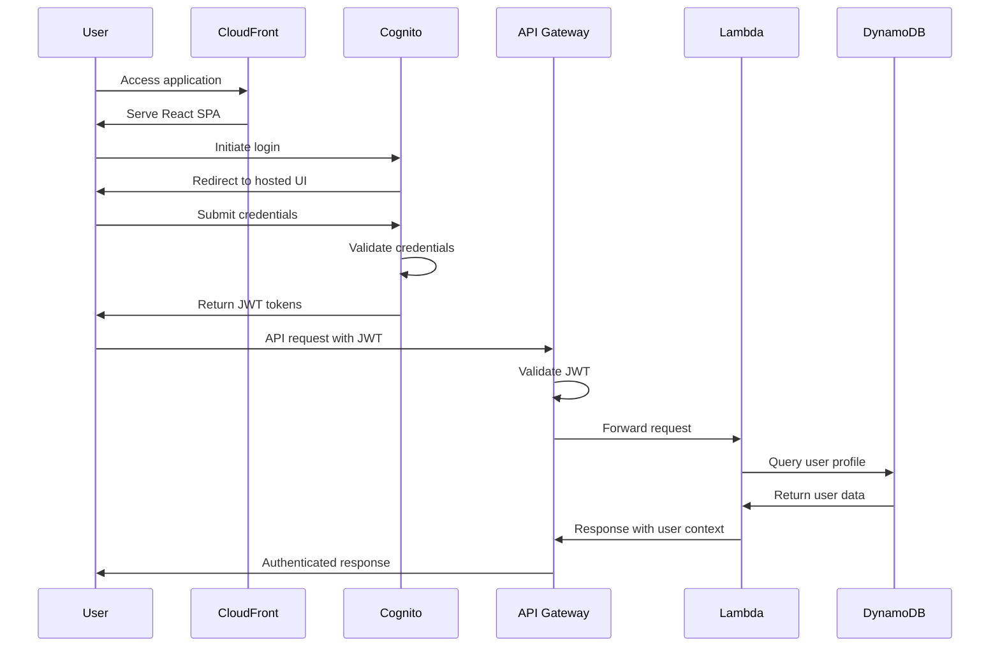
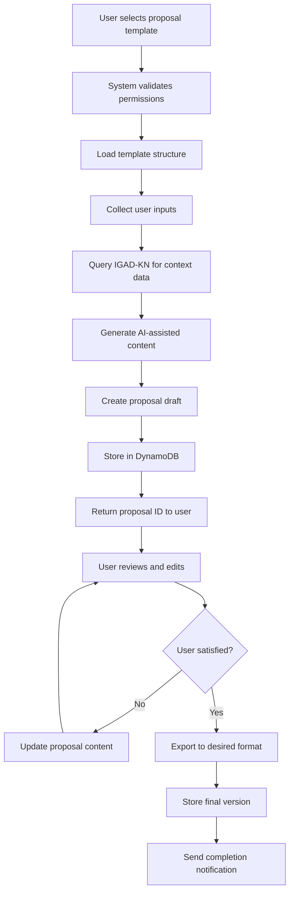
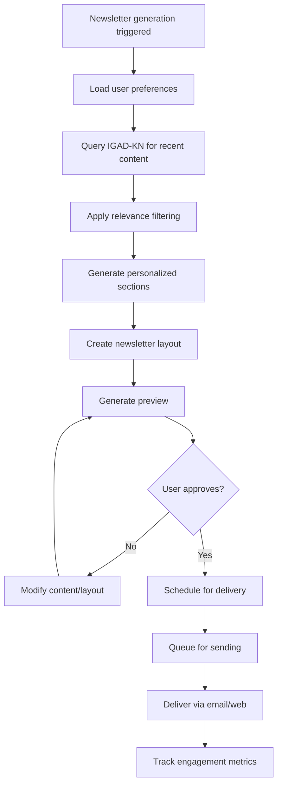
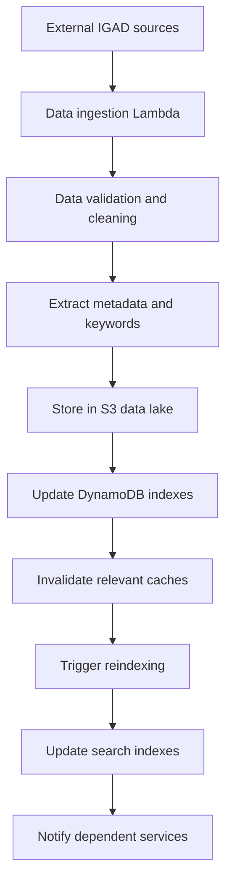

# IGAD Innovation Hub - Data Flow & Workflows

## Authentication Sequence

### User Login Flow


### Token Refresh Workflow
```python
# Automatic token refresh implementation
class TokenManager:
    def __init__(self):
        self.refresh_threshold = 300  # 5 minutes before expiry
    
    async def ensure_valid_token(self) -> str:
        current_token = self.get_stored_token()
        
        if self.is_token_expired(current_token, self.refresh_threshold):
            new_token = await self.refresh_token()
            self.store_token(new_token)
            return new_token
        
        return current_token
    
    def is_token_expired(self, token: str, threshold: int) -> bool:
        payload = jwt.decode(token, options={"verify_signature": False})
        exp_time = payload.get('exp', 0)
        return (exp_time - time.time()) < threshold
```

## Proposal Creation Flow

### End-to-End Proposal Generation


### Proposal Data Processing Pipeline
```python
# Proposal creation workflow implementation
class ProposalWorkflow:
    def __init__(self):
        self.igad_kn = IGADKnowledgeNetworkClient()
        self.ai_service = AIContentGenerator()
        self.template_service = TemplateService()
    
    async def create_proposal(self, user_id: str, template_id: str, inputs: dict) -> dict:
        # Step 1: Validate and load template
        template = await self.template_service.get_template(template_id)
        self.validate_user_access(user_id, template.required_role)
        
        # Step 2: Gather contextual data
        context_data = await self.gather_context_data(inputs, template.data_requirements)
        
        # Step 3: Generate content sections
        proposal_sections = await self.generate_proposal_sections(
            template.sections, 
            context_data, 
            inputs
        )
        
        # Step 4: Create and store proposal
        proposal = ProposalDocument(
            id=generate_uuid(),
            user_id=user_id,
            template_id=template_id,
            sections=proposal_sections,
            status='draft',
            created_at=datetime.utcnow()
        )
        
        await self.store_proposal(proposal)
        
        # Step 5: Audit and notify
        await self.audit_action(user_id, 'proposal_created', proposal.id)
        await self.send_event('proposal.created', proposal.to_dict())
        
        return proposal.to_dict()
    
    async def gather_context_data(self, inputs: dict, requirements: list) -> dict:
        context = {}
        
        for requirement in requirements:
            if requirement.source == 'igad_kn':
                data = await self.igad_kn.query(requirement.query, inputs)
                context[requirement.key] = data
            elif requirement.source == 'user_input':
                context[requirement.key] = inputs.get(requirement.key)
        
        return context
```

## Newsletter Personalization Workflow

### Content Curation and Personalization


### Newsletter Generation Algorithm
```python
class NewsletterPersonalization:
    def __init__(self):
        self.content_scorer = ContentRelevanceScorer()
        self.layout_engine = NewsletterLayoutEngine()
    
    async def generate_personalized_newsletter(self, user_id: str, preferences: dict) -> dict:
        # Get user profile and preferences
        user_profile = await self.get_user_profile(user_id)
        
        # Fetch recent content from IGAD-KN
        recent_content = await self.igad_kn.get_recent_content(
            days=preferences.get('content_days', 7),
            sources=preferences.get('sources', 'all')
        )
        
        # Score and rank content by relevance
        scored_content = []
        for content in recent_content:
            score = self.content_scorer.calculate_relevance(
                content, 
                user_profile, 
                preferences
            )
            if score > preferences.get('min_relevance_score', 0.6):
                scored_content.append((content, score))
        
        # Sort by relevance and select top content
        scored_content.sort(key=lambda x: x[1], reverse=True)
        selected_content = scored_content[:preferences.get('max_articles', 10)]
        
        # Generate newsletter sections
        newsletter_sections = await self.create_newsletter_sections(
            selected_content, 
            user_profile.role,
            preferences.get('layout', 'standard')
        )
        
        # Create newsletter document
        newsletter = NewsletterDocument(
            id=generate_uuid(),
            user_id=user_id,
            sections=newsletter_sections,
            generated_at=datetime.utcnow(),
            personalization_score=self.calculate_overall_score(scored_content)
        )
        
        return newsletter.to_dict()
```

## Event-Driven Data Processing

### EventBridge Integration Pattern
```python
# Event processing for system integration
class IGADEventProcessor:
    def __init__(self):
        self.eventbridge = boto3.client('events')
        self.handlers = {
            'proposal.created': self.handle_proposal_created,
            'newsletter.scheduled': self.handle_newsletter_scheduled,
            'user.action': self.handle_user_action
        }
    
    async def process_event(self, event: dict) -> None:
        event_type = event.get('detail-type')
        handler = self.handlers.get(event_type)
        
        if handler:
            await handler(event['detail'])
        else:
            logger.warning(f"No handler for event type: {event_type}")
    
    async def handle_proposal_created(self, detail: dict) -> None:
        # Update user activity metrics
        # Trigger notification to collaborators
        # Update knowledge base with new proposal patterns
        pass
    
    async def handle_newsletter_scheduled(self, detail: dict) -> None:
        # Queue newsletter for delivery
        # Update delivery metrics
        # Prepare tracking mechanisms
        pass
```

### Caching Strategy and Data Freshness

#### Multi-Level Caching Architecture
```python
class IGADCacheManager:
    def __init__(self):
        self.redis_client = redis.Redis(host=os.environ['REDIS_ENDPOINT'])
        self.cache_ttl = {
            'user_profile': 3600,      # 1 hour
            'igad_kn_query': 1800,     # 30 minutes
            'template_data': 86400,    # 24 hours
            'newsletter_content': 7200  # 2 hours
        }
    
    async def get_cached_data(self, key: str, data_type: str) -> Optional[dict]:
        cached = self.redis_client.get(f"{data_type}:{key}")
        if cached:
            return json.loads(cached)
        return None
    
    async def cache_data(self, key: str, data: dict, data_type: str) -> None:
        ttl = self.cache_ttl.get(data_type, 3600)
        self.redis_client.setex(
            f"{data_type}:{key}", 
            ttl, 
            json.dumps(data)
        )
    
    async def invalidate_cache(self, pattern: str) -> None:
        keys = self.redis_client.keys(pattern)
        if keys:
            self.redis_client.delete(*keys)
```

## Data Synchronization Workflows

### IGAD-KN Data Ingestion Pipeline


### Batch Processing for Knowledge Updates
```python
class IGADKnowledgeSync:
    def __init__(self):
        self.s3 = boto3.client('s3')
        self.dynamodb = boto3.resource('dynamodb')
        self.sqs = boto3.client('sqs')
    
    async def process_knowledge_updates(self, event: dict) -> None:
        # Process S3 event for new/updated documents
        bucket = event['Records'][0]['s3']['bucket']['name']
        key = event['Records'][0]['s3']['object']['key']
        
        # Download and process document
        document = await self.download_document(bucket, key)
        processed_data = await self.extract_knowledge(document)
        
        # Update knowledge base
        await self.update_knowledge_index(key, processed_data)
        
        # Queue for AI reprocessing
        await self.queue_for_reprocessing(key, processed_data)
        
        # Invalidate related caches
        await self.invalidate_related_caches(processed_data.topics)
```

## Error Handling and Recovery Workflows

### Graceful Degradation Strategy
```python
class IGADErrorHandler:
    def __init__(self):
        self.fallback_strategies = {
            'igad_kn_unavailable': self.use_cached_data,
            'ai_service_timeout': self.use_template_defaults,
            'database_error': self.use_local_storage
        }
    
    async def handle_service_error(self, service: str, error: Exception) -> dict:
        error_type = self.classify_error(error)
        fallback = self.fallback_strategies.get(error_type)
        
        if fallback:
            result = await fallback(service, error)
            await self.log_degraded_operation(service, error_type, result)
            return result
        else:
            await self.log_critical_error(service, error)
            raise error
    
    async def use_cached_data(self, service: str, error: Exception) -> dict:
        # Attempt to use cached data when primary service fails
        cache_key = f"fallback:{service}:last_known_good"
        cached_data = await self.cache_manager.get_cached_data(cache_key, 'fallback')
        
        if cached_data:
            return {
                'data': cached_data,
                'status': 'degraded',
                'message': 'Using cached data due to service unavailability'
            }
        
        raise ServiceUnavailableError(f"No fallback data available for {service}")
```

This comprehensive data flow specification ensures robust, scalable, and fault-tolerant operations across all IGAD Innovation Hub components.
